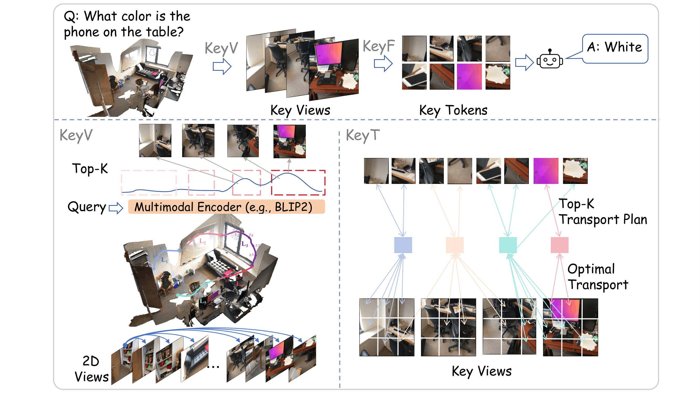

# Zero-Shot 3D Question Answering via Hierarchical View-to-Token Transportation



## 📅 Timeline & News

- **`Jun 03, 2026`**  Preprint available on arXiv! Check out our paper [here](https://arxiv.org/abs/2606.03100).
- **`May 01, 2026`**  **Great News!** Our paper has been officially accepted by [ICML 2026](https://icml.cc/virtual/2026/poster/63796)! 
- **`Jan 30, 2026`**  Repository initialized.

---
  
### 1. **Install the inference package:**
```bash
# following the project llava
conda create -n keyvt python=3.10 -y
conda activate keyvt
pip install --upgrade pip
pip install -e ".[train]"
```

### 2. **Install the other package:**
```bash
pip install easydict flash-attn==2.5.7
```

### 3. **KeyV Geometry aware view sampling**
```bash
# Get camera parameters
python3 KeyV/fastvggt.py
# Divide the scene
python3 KeyV/cal_bias.py
# Allocate views for each segment
python3 KeyV/select_frames.py
```
### 4. **KeyT OT-based key tokens selection**
```bash
#Go to 
/ScanQA_SQA/cdviews/KeyT.py
```
### 5. **Evaluation**
```bash
# Evaluate ScanQA & SQA3D
cd ./geo/ScanQA_SQA/scripts
bash eval.sh

# Evaluate VSI-bench
cd ./geo/vsi_test/scripts
bash evaluate_vsibench.sh

```
